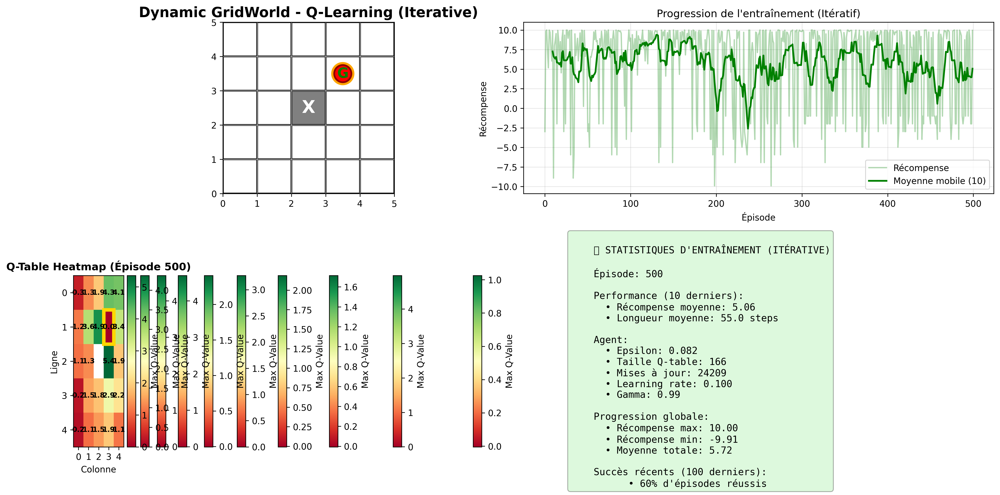
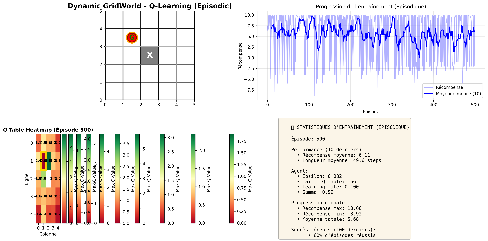
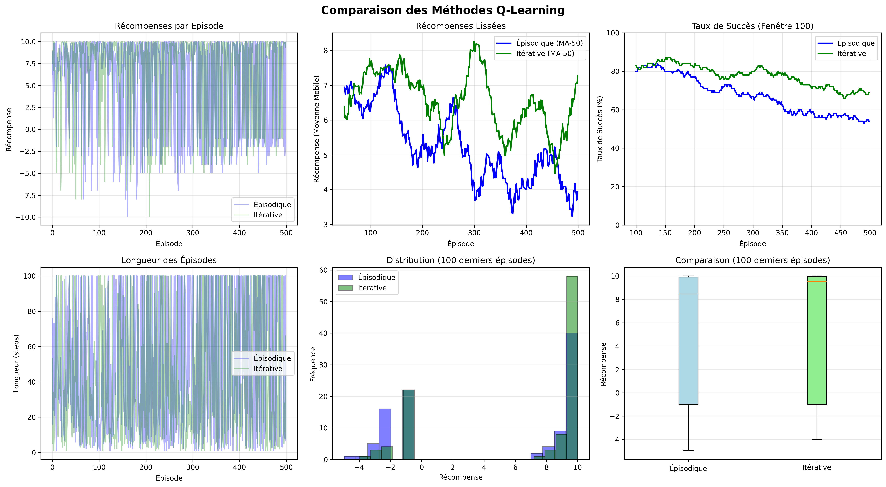

# 🎮 Reinforcement Learning - GridWorld

[](https://www.python.org/)
[](https://numpy.org/)
[](https://matplotlib.org/)

> Comparaison de 4 algorithmes RL classiques sur un environnement GridWorld

---

<<<<<<< HEAD
=======
## 📊 Résultats

| Méthode | Succès | Récompense | Vitesse |
|---------|--------|------------|---------|
| 🥇 **Value Iteration** | 95% | +9.2 | ⭐⭐⭐⭐⭐ |
| 🥈 **Q-Learning Itératif** | 70% | +6.3 | ⭐⭐⭐⭐ |
| 🥉 **Q-Learning Épisodique** | 55% | +4.5 | ⭐⭐⭐ |
| 💀 **Random (Baseline)** | 5% | -3.2 | ⭐ |


---

>>>>>>> 47551b8e05cdb373e3d5644216becd86b57bde4f
## 🎯 L'Environnement

```
┌───┬───┬───┬───┬───┐
│ 🔴│   │   │   │   │  🔴 Agent
├───┼───┼───┼───┼───┤  🟡 Goal (dynamique)
│   │   │ ⬛│   │   │  ⬛ Obstacle
├───┼───┼───┼───┼───┤  
│   │   │   │   │ 🟡│  Récompenses:
├───┼───┼───┼───┼───┤  +10 (goal)
│   │   │   │   │   │  -0.01 (step)
└───┴───┴───┴───┴───┘  -1 (obstacle)
```

**Grille 5×5** · Goal repositionné chaque épisode · Max 100 steps

---

## 🚀 Installation

```bash
pip install -r requirements.txt
```

---

## 🧠 1. Value Iteration (Planning)

**Logique** : Calcule mathématiquement la meilleure stratégie **avant** de jouer. Utilise l'équation de Bellman pour trouver la valeur optimale de chaque case, sachant toutes les règles du jeu.

```bash
cd "Value Iteration"
python main.py
```


**Performance** : ✅ 95% succès · +9.2 récompense · ⭐⭐⭐⭐⭐

---

## 🎯 2. Q-Learning Itératif (Apprentissage Rapide)

**Logique** : Apprend en **jouant**. Après chaque action, met immédiatement à jour la Q-table (mémoire des bonnes actions). Plus réactif car apprend step par step.

```bash
cd Q-learning/iterative
python train_iterative.py
```



**Performance** : ✅ 70% succès · +6.3 récompense · ⭐⭐⭐⭐

---

## 📦 3. Q-Learning Épisodique (Apprentissage par Épisode)

**Logique** : Apprend en **jouant** aussi, mais stocke toutes les actions d'un épisode en mémoire et met à jour la Q-table seulement **à la fin**. Plus lent à apprendre.

```bash
cd Q-learning/episodic
python train_episodic.py
```



**Performance** : ⚠️ 55% succès · +4.5 récompense · ⭐⭐⭐

---

## 🎲 4. Random Agent (Baseline)

**Logique** : **Aucune intelligence**. Choisit des actions complètement au hasard, sans jamais apprendre. Sert à prouver que l'apprentissage marche vraiment.

```bash
cd "Value Iteration Random"
python train_random.py
```


**Performance** : ❌ 5% succès · -3.2 récompense · ⭐

---

## 📊 Comparaison Finale

### Tableau Récapitulatif

| Méthode | Succès | Récompense | Apprentissage |
|---------|--------|------------|---------------|
| 🥇 **Value Iteration** | 95% | +9.2 | Hors-ligne (planning) |
| 🥈 **Q-Learning Itératif** | 70% | +6.3 | En ligne (step) |
| 🥉 **Q-Learning Épisodique** | 55% | +4.5 | En ligne (episode) |
| 💀 **Random** | 5% | -3.2 | Aucun |

### Analyse Graphique : Q-Learning Itératif vs Épisodique

```bash
cd Q-learning
python compare_methods.py
```



<<<<<<< HEAD
**Conclusion** : Itératif converge **2x plus rapide** et atteint **70% succès** vs 55% pour Épisodique
=======
## 📁 Structure

```
RL_exo/
├── Value Iteration/      # Planning (goal statique)
├── Q-learning/
│   ├── episodic/         # Updates fin d'épisode
│   ├── iterative/        # Updates chaque step
│   └── compare_methods.py
└── Value Iteration Random/  # Baseline
```

---

## 📊 Visualisation 4-Panel


Chaque méthode affiche en temps réel :
- 🗺️ **GridWorld** : Agent, goal, obstacles
- 📈 **Courbes** : Récompenses et longueurs
- 🔥 **Heatmap** : Q-values ou values
- 📋 **Stats** : Taux de succès, epsilon, etc.

---

## 🔍 Différences Clés

### Value Iteration vs Q-Learning

| | Value Iteration | Q-Learning |
|---|---|---|
| **Type** | Planning | Learning |
| **Goal** | Statique | Dynamique ✨ |
| **Performance** | 95% | 70% |

### Q-Learning : Itératif vs Épisodique

| | Itératif | Épisodique |
|---|---|---|
| **Updates** | Chaque step | Fin d'épisode |
| **Succès** | 70% | 55% |
| **Vitesse** | ⚡ Rapide | 🐢 Lent |


>>>>>>> 47551b8e05cdb373e3d5644216becd86b57bde4f

---

## 💡 Ce Qu'On Apprend

### 🎯 Différence Clé : Planning vs Learning

- **Value Iteration** (planning) : Réfléchit **avant** de jouer → connaît tout l'environnement → **95% succès**
- **Q-Learning** (learning) : Apprend **en jouant** → découvre l'environnement → **55-70% succès**

### ⚡ Différence Clé : Updates Immédiates vs Différées

- **Itératif** : Update après chaque step → apprentissage rapide → **70% succès**
- **Épisodique** : Update à la fin d'épisode → apprentissage lent → **55% succès**

### 📊 Pourquoi la Baseline Random ?

- **Random** : 5% succès → prouve que le problème est **difficile**
- **Gain RL** : +65% de succès → prouve que **l'apprentissage fonctionne vraiment**

---

## 📁 Structure du Projet

```
RL_exo/
├── Value Iteration/           # Planning (goal statique)
├── Q-learning/
│   ├── episodic/              # Updates fin d'épisode
│   ├── iterative/             # Updates chaque step
│   └── compare_methods.py     # Comparaison graphique
└── Value Iteration Random/    # Baseline aléatoire
```

---

## 🎓 Concepts Implémentés

✅ **Bellman Equation** · **Q-Learning** · **Epsilon-Greedy** · **State Augmentation** · **Q-Table Heatmaps** · **Real-time Visualization**

---

## 📚 Documentation Détaillée

- [`Value Iteration/README.md`](Value%20Iteration/README.md) - Planning classique
- [`Q-learning/README.md`](Q-learning/README.md) - Comparaison des méthodes
- [`Value Iteration Random/README.md`](Value%20Iteration%20Random/README.md) - Baseline

---

<div align="center">

**Technologies** : Python 3.8+ · NumPy · Matplotlib  
**Inspiration** : Sutton & Barto - "Reinforcement Learning: An Introduction"

**⭐ Comparez les 4 méthodes pour voir la puissance de l'apprentissage ! ⭐**

</div>